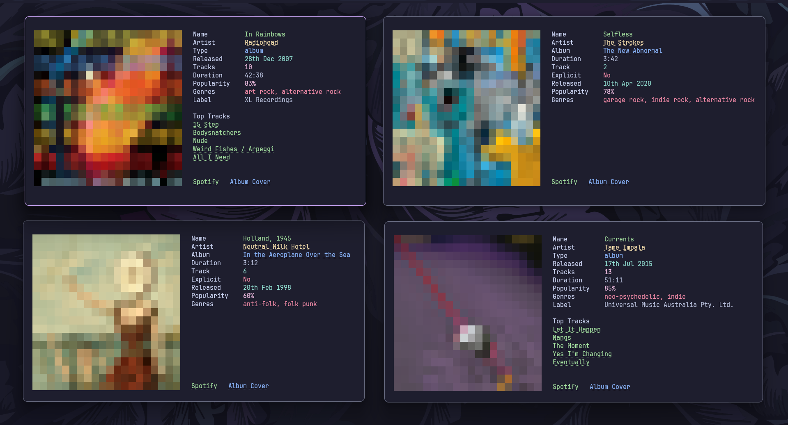

<h1 align="center">mufetch</h1>

<p align="center">Neofetch-style CLI for music</p>

<p align="center">

</p>

<p align="center">
  <i>Supported by</i>
</p>
<p align="center">
  <a href="https://terminaltrove.com/mufetch/">
    
  </a>
</p>

---

## Features

- **Beautiful terminal display** with album cover art and artist photos
- **Comprehensive metadata** including tracks, albums, and artist information
- **Interactive clickable links** for Spotify URLs and cover art
- **Responsive sizing** via customizable image dimensions
- **Cross-platform support**, works in all modern terminals

### Supported Content Types

| Type | Metadata Displayed |
|------|-------------------|
| **Tracks** | Name, Artist, Album, Duration, Track Number, Explicit, Release Date, Popularity, Genres |
| **Albums** | Name, Artist, Type, Release Date, Track Count, Duration, Popularity, Genres, Label, Top Tracks |
| **Artists** | Name, Followers, Popularity, Genres, Albums & Singles Count, Top Tracks |

---

## Installation

### Nix

```bash
nix run nixpkgs#mufetch
```

### Via `go install`

```bash
go install github.com/ashish0kumar/mufetch@latest
```

### Build from Source

```bash
git clone https://github.com/ashish0kumar/mufetch.git
cd mufetch/
go build
sudo mv mufetch /usr/local/bin/
mufetch --help
```

## Setup

### 1. Get Spotify API Credentials

1. Go to [Spotify Developer Dashboard](https://developer.spotify.com/dashboard)
2. Log in with your Spotify account
3. Click **"Create an App"**
4. Fill in app name and description
5. Copy your **Client ID** and **Client Secret**

### 2. Configure `mufetch`

Run the authentication setup

```bash
mufetch auth

Enter your Spotify Client ID: your_client_id_here
Enter your Spotify Client Secret: your_client_secret_here
```

---

## Usage

### Basic Commands

#### Auto-detect and search for music

```bash
mufetch search "Bohemian Rhapsody"
mufetch search "Smells Like Teen Spirit"
mufetch search "Let It Happen"
```

#### Search specific content types

```bash
mufetch search "Hotel California" --type track
mufetch search "Pink Floyd" --type artist
mufetch search "Ok Computer" --type album
```

#### Customize image size (20-50)

```bash
mufetch search "All I Need" --size 25
mufetch search "Holland, 1945" -s 40
```

### Search Types

- **`track`** - Search for specific songs
- **`album`** - Search for albums or EPs
- **`artist`** - Search for musicians and bands

### Image Sizing

- **Default**: `20x20` pixels
- **Range**: `20-50` pixels

---

## Configuration

mufetch stores configuration in `~/.config/mufetch/config.yaml`:

```yaml
spotify_client_id: "your_client_id"
spotify_client_secret: "your_client_secret"
```

### Environment Variables

You can also set credentials via environment variables:

```bash
export MUFETCH_SPOTIFY_CLIENT_ID="your_client_id"
export MUFETCH_SPOTIFY_CLIENT_SECRET="your_client_secret"
```

---

## Contributing

Contributions are always welcome! Whether you want to:

- Report bugs or issues
- Suggest new features
- Improve the visual design
- Enhance documentation
- Submit code improvements

Please feel free to open an issue or submit a pull request.

## Dependencies

- [**Cobra**](https://github.com/spf13/cobra) - CLI framework and command structure
- [**Viper**](https://github.com/spf13/viper) - Configuration management
- [**Imaging**](https://github.com/disintegration/imaging) - Image processing and resizing

## Acknowledgments

- Inspired by [neofetch](https://github.com/dylanaraps/neofetch) for system information display
- Thanks to [Spotify Web API](https://developer.spotify.com/documentation/web-api/) for music metadata
- Unicode block art technique inspired by various terminal image viewers

<br>

<p align="center">
	
</p>

<p align="center">
        <i><code>&copy 2025-present <a href="https://github.com/ashish0kumar">Ashish Kumar</a></code></i>
</p>

<div align="center">
<a href="https://github.com/ashish0kumar/mufetch/blob/main/LICENSE"></a>&nbsp;&nbsp;
</div>
